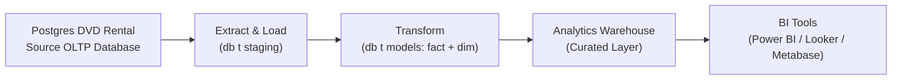

📀 DVD Rental Modern Data Pipeline (GCP + dbt + Docker + Looker)

This project implements a full modern data analytics pipeline using the classic DVD Rental dataset.
It simulates a real-world data engineering workflow—from an OLTP database to a fully modeled warehouse and business dashboard.

  The goal is to demonstrate:
  
  >> Data extraction from a transactional database
  
  >> Cloud data storage on GCS
  
  >> Data warehousing on BigQuery
  
  >> Transformation modeling using dbt
  
  >> Deployment using Docker
  
  >> Final business analytics using Looker Studio

🗄️ 1. OLTP Source — Postgres DVD Rental

The project includes a Dockerized Postgres database running the official DVD Rental dataset.

>> Why? 

This simulates the operational system from which analytics pipelines usually extract data.

--Location :
/postgres_dvdrental

Features :

  Postgres 15 Docker image
  
  Auto-loaded DVD Rental schema & data
  
  Acts as the source of truth for extraction
  
  Mimics a production OLTP store

2. Extraction Layer — Postgres → GCS → BigQuery :

   Logic:

   >> Read tables from Postgres
    
   >> Export them as CSV/Parquet to GCS
    
   >> Load them into BigQuery raw tables

🧱 3. Transformation Layer — dbt on BigQuery

dbt is used to transform raw data into clean models following the medallion architecture:

🥇 3.1 Staging Models (stg_*)

Purpose:
    Clean column names
    Standardize types
    Apply minimal transformations
    Prepare the base layer

Examples:

> stg_customer
> stg_film
> stg_inventory
> stg_rental
> stg_payment
> stg_store

🥈 3.2 Intermediate Models (int_*)

These combine multiple staging models to form enriched datasets.

Examples:

> int_rental_details
> int_film_details
> int_sales_enriched

🥇 3.3 Mart Models (mart_*)

Business-ready tables for analytics.

Included marts :

| Model                         | Description                               |
| ----------------------------- | ----------------------------------------- |
| `mart_revenue_by_store`       | Revenue, rentals, avg value per store     |
| `mart_top_customers`          | Highest-spending customers                |
| `mart_category_performance`   | Rentals and revenue per film category     |
| `mart_top_films`              | Most profitable films                     |
| `mart_monthly_revenue_trends` | Revenue trends for time-series dashboards |

🧪 4. Data Quality Tests (dbt)

The project includes schema tests, custom tests, and relationship tests.

✔️ Generic tests:

  unique
  not_null
  relationships
  accepted_values

📊 5. Analytics Layer — Looker Studio Dashboard

Final insights are built on top of the mart_* tables.

Main KPIs displayed:

    Total Revenue
    Revenue by Store
    Top Categories
    Top Customers
    Top Films
    Monthly Revenue Trend
    Average Rental Duration
    Number of Rentals

Components used:

    Scorecards
    Bar charts
    Pie charts
    Line charts
    Tables + conditional formatting
    Filters (date, store, category)

Business questions answered:

> Which store performs best?
> Which film categories generate the most revenue?
> Who are our most valuable customers?
> What is the revenue trend over the year?
> Which films generate the most income?

🐳 6. How to Run the Project (Quick Start) :

!!! note : before running the project you need to replace the variable used in scripts and docker-compose.yml , Advice create a .env and get your own variables 

1️⃣ Start Postgres OLTP

GO to /postgress_dvdrental then run >> 

    docker-compose up -d  

after running the docker-compose run this iside the container !!(replace the username with yours ):

    pg_restore -U username -d dvdrental /docker-entrypoint-initdb.d/dvdrental.tar

now you ll have the postgres with all the oltp tables inside . 

2️⃣ Extract → GCS → BigQuery

now the Eextract and Load part (EL) : 
you have 3 main scripts for now (!note that we could add little transformation in here or more security part ) :

extract.py
load_to_bucket.py
load_into_bigQuery.py

first use the envirement pipelineGCP :
in linux : 

    source ./pipelineGCP/bin/activate

then run the each python file (! ofc you need to have an account in gcp and cofigure access controle and get access variables , but m ll not go into that )

3️⃣ Run dbt transformations 

inside /the dvdrental_dbt run 

    dbt run
once you ve done that , you ll have the bussiness redy tables inside you bigQuery dataset 

5️⃣ Build Looker dashboard :

last part connect your looker dashboard to bigQuery and create your own dashboard

   
